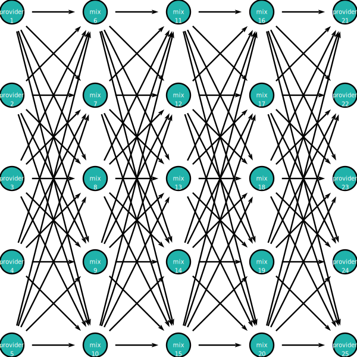
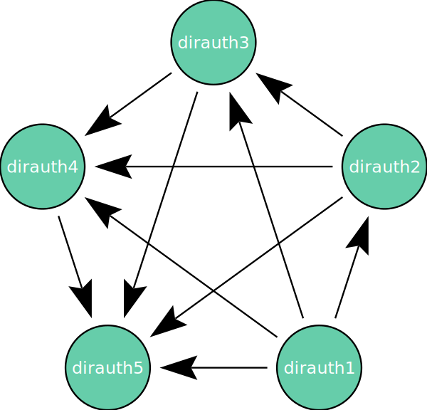

# diagrams

Given that we have a nested encryption format for messages and that all
messages will be cryptographically transformed at each hop through the network.
Let us assume that at each hop, input messages will be bitwise unlinkable to output messages from the perspective of a passive network observer.

Consider a batch mix where a batch of 5 messages enter the mix:

Five messages are "mixed" and then sent out. An network observer will have a 1/5 chance of guessing which input message corresponds to which output message. The added latency in a batch mix is used to accumulate the messages for that batch.

There are other categories of mix strategy such as continuous time mixing strategies where messages can enter and exit the mix at anytime without the restrictions of a batch mix. Katzenpost uses a continuous time mixing strategy with exponential delays for each hop selected by the clients.

Users of a mix network don't have to depend on a single mix node to be honest because their route is composed to form a cascade of mix nodes.

