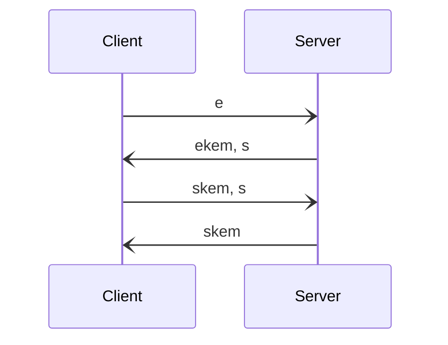

Katzenpost uses the pqXX Post Quantum Noise pattern:

```
pqXX:
-> e
<- ekem, s
-> skem, s
<- skem
```



Here's the comparison between XX and pqXX patterns, from the PQNoise paper:


Here's the pqXX algorithm from the PQNoise paper:


