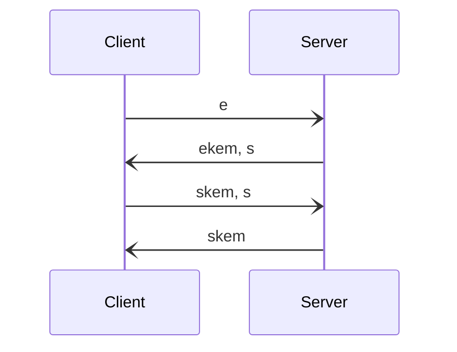

# Noise

Katzenpost uses Post Quantum Noise as described in the paper:

Post Quantum Noise
https://eprint.iacr.org/2022/539


Our Noise protocol descriptor string is:

	Noise_pqXX_Kyber768X25519_ChaChaPoly_BLAKE2s


The assumption is that the hybrid KEM is IND-CCA2 as a result of being
properly composed with a security preserving KEM combiner and a NIKE
to KEM adapter with semantic security.


## The pqXX Post Quantum Noise pattern

The Noise protocol spec ( https://noiseprotocol.org/noise.html ) explains the
pattern notation.

```
pqXX:
-> e
<- ekem, s
-> skem, s
<- skem
```

### 4-step handshake narrative

In the XX senario both parties have long term keypairs and depending
on how you'd like to use this pattern in your application, one or both
parties can authenticate each other against a prior known public key.

Therefore the goal of this handshake is to cryptographically prove
ownership of the private key corresponding to the known long term
public key.

Here's a simplificaton where we ignore the hash objects:

1. client generates a new KEM ephemeral keypair and sends the public
key to the server
2. server crates a KEM ciphertext using the client's ephemeral public
key. The shared secret is used to symmetrically encrypt the server's
long term public key.
3. The client receives (is able to decrypt) the server's long term public key and can make
the authentication comparison with the public key it expected to
receive. The client uses the server's long term public key to create a
new KEM ciphertext. The shared secret is used to symmetrically encrypt
the client's long term public key.
4. Server receives (is able to decrypt) the client's long term static
public key and uses it to create a KEM ciphertext.


The server will only be able to learn the client's long term public key if
they are able to decapsulate the KEM ciphertext sent to them in step 3.
This requires the private key corresponding to the known long term public key.




Here's the comparison between XX and pqXX patterns, from the PQNoise paper:


Here's the pqXX algorithm from the PQNoise paper:


