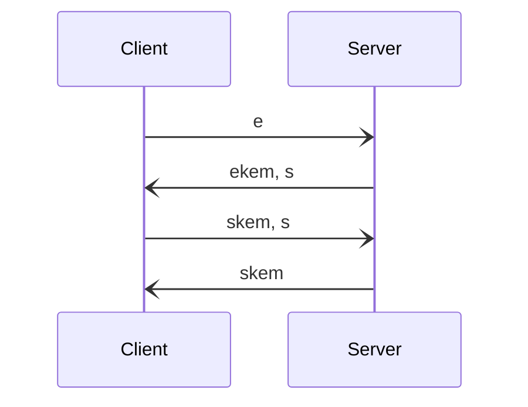

Katzenpost uses the pqXX Post Quantum Noise pattern:

```
pqXX:
-> e
<- ekem, s
-> skem, s
<- skem
```


```mermaid
sequenceDiagram
    Client-)Server: e
    Server-)Client: ekem, s
    Client-)Server: skem, s
    Server-)Client: skem
```

Here's the comparison between XX and pqXX patterns:


