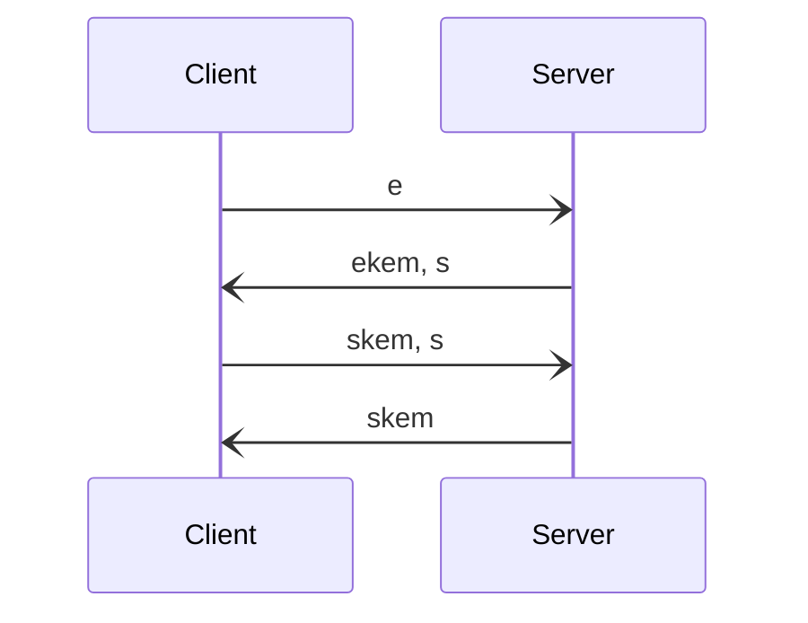
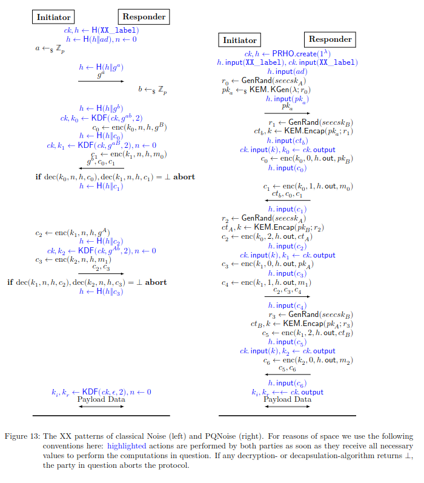
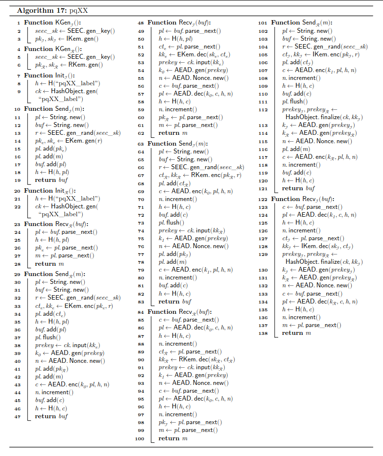

# Noise

Katzenpost uses Post Quantum Noise as described in the paper:

Post Quantum Noise
https://eprint.iacr.org/2022/539


Our Noise protocol descriptor string is:

	Noise_pqXX_Kyber768X25519_ChaChaPoly_BLAKE2s


The assumption is that the hybrid KEM is IND-CCA2 as a result of being
properly composed with a security preserving KEM combiner and a NIKE
to KEM adapter with semantic security.


## The pqXX Post Quantum Noise pattern

The Noise protocol spec ( https://noiseprotocol.org/noise.html ) explains the
pattern notation.

```
pqXX:
-> e
<- ekem, s
-> skem, s
<- skem
```



Here's the comparison between XX and pqXX patterns, from the PQNoise paper:




Here's the pqXX algorithm from the PQNoise paper:



